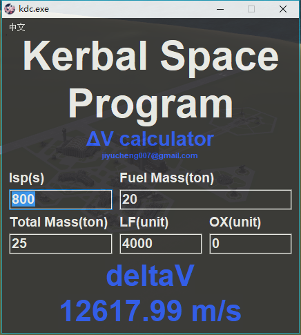
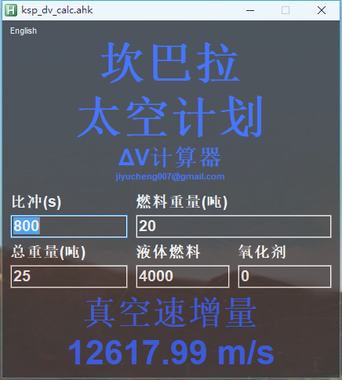

# Kerbal Space Program DeltaV calculator

## intro

1. Click title to switch topmost mode.
2. Click top left to change language.
3. Click the blank place to move the window.
4. Set the Fuel Mass would calculate the LF and OX automatically.
5. And you can manually set the LF and OX too.

## 说明

1. 点击标题可以切换置顶。
2. 点击左上角可以改变语言。
3. 点击空白处可拖动窗口。
4. 设置燃料重量会自动计算液体燃料和氧化剂单位。
5. 你也可以手动分别设置液体燃料和氧化剂的量。

## add translate

If you wanna help translate the software to other language, use the `PR` please.